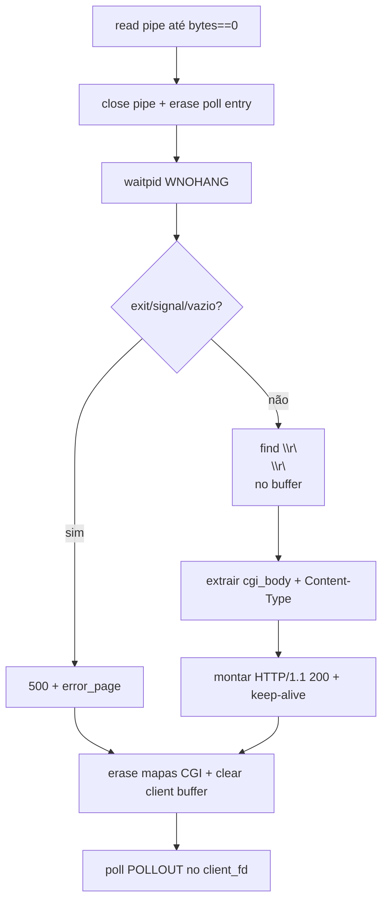

**_Progresso:_**

**Data:** 2026-05-21
**Componente:** SocketServer (CGI) / ParserConf / TrateRequest / default.conf

**Resumo Técnico:**
- **`handleCGIRead` — resposta HTTP a partir da saída CGI:** O servidor deixou de repassar o buffer bruto do pipe como corpo HTTP. No caminho de sucesso, após `waitpid` e validação de saída, o fluxo passa a: (1) localizar `\r\n\r\n` no `_cgi_buffers[pipe_fd]`; (2) tratar o trecho anterior como headers CGI e o posterior como `cgi_body`; (3) extrair `Content-Type` do bloco de headers (fallback `text/html`); (4) montar `HTTP/1.1 200` com `Content-Length` baseado só em `cgi_body` e `Connection: keep-alive`. O cleanup (`_cgi_buffers.erase`, mapas pipe→client/pid, `_client_buffers.clear`, `POLLOUT`) permanece após o `if/else` de erro/sucesso, no mesmo método.
- **Correção de compilação:** Chaves ausentes no `if (Content-Type:)` geraram `-Werror=unused-variable`, `misleading-indentation` e fechamento prematuro da função; reestruturado com blocos explícitos — `make re` OK.
- **Multi-porta:** `default.conf` ganhou segundo bloco `server` em `8081`. `ParserConf::getPorts()` agrega `ports` de todos os `_servers` (antes só `_servers[0]`); `SocketServer` já consome via construtor (`_ports = config.getPorts()`).
- **`TrateRequest::sendPage`:** Inclusão de `\r\n` após `status_header` na montagem do header de arquivos estáticos.

**Decisões de Arquitetura:**
- Conformidade com o contrato CGI (RFC 3875): o script emite cabeçalhos + corpo separados por linha em branco; o webserv traduz isso para headers HTTP/1.1 próprios, evitando que o cliente interprete `Status:`/`Content-Type:` do script como lixo no body.
- `getPorts()` iterando todos os servidores alinha configuração N×`listen` com o loop de `bind`/`listen` do `SocketServer`, sem threads nem processos extras.
- Parse de headers CGI feito com `std::string::find`/`substr` (C++98), sem máquina de estados — suficiente para `Content-Type` único no output atual.

**Desafios:**
- Build quebrado por `if` de uma linha sem `{ }`: o compilador associou só a declaração de `ct_end` ao `if (ct != npos)`, deixando o restante fora de escopo e um `}` extra fechando `handleCGIRead` antes do cleanup.
- Comportamento anterior: `Content-Type: application/json` fixo e `Content-Length` do output inteiro faziam o browser exibir headers CGI como conteúdo — corrigido ao separar body real e propagar o tipo declarado pelo script.

**Fluxo CGI (pós-pipe fechado):**

___

**Data:** 2026-05-14 (Hardening e Limpeza de Assets)
**Componente:** TrateRequest / Persistência / I/O

**Resumo Técnico:**
- **Runtime Directory Hardening:** Implementada a criação automática dos diretórios de persistência (`uploads/` e `data/`) dentro do fluxo de salvamento do currículo (`ifPost.cpp`). O uso da syscall `mkdir()` com máscara `0755` garante que o servidor consiga realizar operações de escrita mesmo em ambientes "limpos" onde o Git não clonou pastas vazias.
- **Limpeza de Assets Obsoletos:** Removido o arquivo `www/data/default_curriculum.json`. A lógica de fallback do servidor foi ajustada para retornar um objeto JSON vazio `{}` via `ifGet.cpp`, simplificando a gestão de estado inicial da aplicação.
- **Sincronização de Documentação:** Atualizado o `README.md` para refletir o novo comportamento da API e remover referências a arquivos de exemplo excluídos.

**Decisões de Arquitetura:**
- A criação de pastas em runtime foi centralizada no momento da primeira escrita necessária, evitando a necessidade de scripts de setup complexos ou dependência de configurações externas do sistema operacional.
- O privilégio `0755` foi escolhido para equilibrar a necessidade de escrita do processo do servidor com a segurança de leitura pública para o servidor HTTP.

**Desafios:**
- Identificado Erro 500 em clones novos do repositório devido à ausência de diretórios não versionados, mitigado com a verificação e criação preventiva via código.

___

**Data:** 2026-05-14 (Estabilização e Hardening)
**Componente:** SocketServer / Sinalização / Gestão de Memória

**Resumo Técnico:**
- **Proteção SIGPIPE:** Implementada a ignorância do sinal `SIGPIPE` (`signal(SIGPIPE, SIG_IGN)`) no construtor do `SocketServer`. Esta medida evita que o processo seja encerrado abruptamente pelo kernel quando tenta realizar um `send()` em um socket cujo lado cliente já foi fechado (comum em testes de estresse com `Siege`).
- **Limpeza de Memória (Shutdown):** Refatorado o destrutor `~SocketServer()` para realizar o `.clear()` explícito de todos os mapas internos (`_client_buffers`, `_client_responses`, `_cgi_buffers`, etc.). 
- **Validação Valgrind:** As mudanças visam reduzir o rastro de memória "still reachable" no encerramento do servidor, garantindo que objetos alocados dinamicamente durante o tempo de vida do servidor sejam liberados corretamente ao receber um `SIGINT`.

**Decisões de Arquitetura:**
- A decisão de ignorar o `SIGPIPE` em vez de tratá-lo por thread/operação baseia-se na simplicidade e eficácia para o modelo multiplexado (`poll`) do projeto, onde o erro de escrita já é tratado individualmente pelo retorno da syscall `send`.
- O reforço no destrutor garante a integridade da desalocação mesmo em cenários de encerramento controlado por sinais.

**Desafios:**
- Identificada a interrupção prematura do servidor durante testes de carga, causada pela ação padrão do sistema para pipes quebrados, o que impedia a execução dos destrutores e gerava falsos positivos de vazamento de memória no Valgrind.

___

**Data:** 2026-05-14 (Finalização e Estabilização)
**Componente:** SocketServer / TrateRequest / Bug Fixes

**Resumo Técnico:**
- **Bug Fix 1 & 2 (Beatriz):** Corrigido o gerenciamento de conexões para usar `Connection: keep-alive` por padrão e removido o caractere `\r\n` duplicado nos headers de status, normalizando a comunicação com o browser.
- **Bug Fix 5 (Claudio):** Implementada a limpeza obrigatória do buffer do cliente (`_client_buffers[fd].erase()`) também no fluxo de CGI. Isso garante que requisições subsequentes via Keep-Alive não sejam corrompidas por dados residuais.
- **Arquitetura Não-Bloqueante:** Reforçada a lógica de "early return" no `handleClientData`, permitindo que o servidor aguarde o restante do corpo da requisição (POST grande) sem travar o loop de eventos.
- **Sincronização Final:** Integradas as correções de CGI Timeout (BUG 4) e Longest Prefix Match (BUG 3), tornando o roteamento e a resiliência do servidor condizentes com os requisitos da escala.

**Decisões de Arquitetura:**
- Mantida a estratégia de I/O assíncrona: o servidor nunca espera por dados; ele armazena o estado parcial e cede o controle de volta ao `poll()`.
- Unificação das branches concluída com sucesso, resultando em um binário único e estável que respeita todas as diretivas do `default.conf`.

**Desafios:**
- Resolução de conflitos de lógica no `SocketServer.cpp` onde o fluxo de CGI e o fluxo normal de arquivos estáticos precisavam compartilhar o mesmo mecanismo de limpeza de buffer para suportar conexões persistentes.

___

**Data:** 2026-05-12 (Merge Final)
**Componente:** Sistema Completo / Merge Branch Request

**Resumo Técnico:**
- Unificada a branch `Request` com a branch `Socket`, consolidando as funcionalidades de rede, parsing e tratamento de requisições.
- Resolvidos conflitos críticos de integração no `SocketServer.cpp` e `TrateRequest.hpp`, garantindo que a classe `ParserConf` seja injetada corretamente em todo o fluxo.
- Consolidado o loop de eventos (`poll`) com suporte completo e assíncrono para CGI.
- Verificada a compilação total do projeto via `Makefile`.

**Decisões de Arquitetura:**
- Arquitetura Final: `SocketServer` (Multiplexação/Poll) -> `ParserRequest` (Parsing HTTP) -> `TrateRequest` (Lógica de Métodos/CGI/Static) -> `ParserConf` (Configurações/Segurança).
- Injeção de dependência mantida: O objeto `_config` é passado do `main` para o `SocketServer` e dele para o `TrateRequest`, permitindo que o servidor seja configurável via arquivo sem recompilação futura.

**Desafios:**
- Resolução de conflitos de merge causados por desenvolvimentos paralelos na detecção de CGI e integração de configurações.
- Sincronização de headers duplicados e caminhos de include inconsistentes entre as pastas `conf/` e `src/Conf/`.

___

**Data:** 2026-05-12 (Final)
**Componente:** TrateRequest / Sincronização ParserConf

**Resumo Técnico:**
- Finalizada a sincronização da classe `TrateRequest` com o sistema `ParserConf`.
- Atualizado o construtor e os métodos helper (`ifGet`, `ifPost`, `ifDelete`, `executeCGI`) para aceitar e utilizar o objeto de configuração.
- Corrigido o erro de compilação no `SocketServer.cpp` al instanciar o handler com a referência de configuração correta.

**Decisões de Arquitetura:**
- Injeção de dependência: `TrateRequest` agora recebe `ParserConf` por referência, permitindo validações de segurança (CGI extensions, method allowed) e roteamento dinâmico (root, index) baseados no arquivo de configuração.
- Consistência de tipos: Garantido que todos os módulos do servidor utilizem a mesma fonte de verdade para configurações.

**Desafios:**
- Sincronização manual de múltiplos arquivos de implementação (`ifGet.cpp`, `ifPost.cpp`, etc.) para garantir que a assinatura do construtor fosse respeitada em todo o projeto.

___

**Data:** 2026-05-12
**Componente:** SocketServer / Integração ParserConf / CGI

**Resumo Técnico:**
- Restaurada a integração completa da classe `ParserConf` no `SocketServer` e `main.cpp`.
- Corrigido o bug de interceptação de CGI no loop de eventos (`poll`), permitindo que o servidor diferencie pipes de CGI de sockets de clientes.
- Re-sincronizados os arquivos `.hpp` e `.cpp` do SocketServer para suportar a passagem do objeto de configuração por referência.

**Decisões de Arquitetura:**
- O `SocketServer` agora é dependente de uma instância de `ParserConf`, garantindo que todas as decisões de roteamento e limites (como `client_max_body_size`) sejam baseadas no arquivo de configuração.
- Implementada lógica de "CGI check" no event loop para evitar que o output de scripts Python seja enviado erroneamente para o parser de requests HTTP.

**Desafios:**
- Resolvido erro de compilação causado por mismatch de assinaturas no construtor entre o header e a implementação.
- Identificada a necessidade de busca por prefixo no `ParserConf` para suportar arquivos dentro de diretórios configurados (ex: `/cgi-bin/`).

___

**Data:** 2026-05-11 (mais recente)  
**Componente:** Parser de configuração e testes de validação HTTP
  
**Resumo Técnico:**  
- **Diff realizado:** comparado staging area (git diff --cached) vs working tree.  
- **ParserConf.hpp/cpp:** implementado parser completo de configuração com métodos específicos: `parsePort()`, `parseServerName()`, `parseRoot()`, `parseLocation()`, `parseErrorPage()`. Membros privados movidos para public para acesso temporário durante desenvolvimento.  
- **default.conf:** expandido com múltiplos server blocks, `client_max_body_size 1M`, páginas de erro customizadas (400, 403, 404, 405, 413, 500), e locations específicas (`/upload` POST-only, `/old-path` redirecionamento).  
- **CGI date.py:** script Python para retornar timestamps em múltiplos formatos (JSON, ISO, timestamp Unix) com fallback para arquivo `curriculum.json` por PID.  
- **Front-end:** atualizado `curriculo.js` para obter PID via `/api/pid` e passar como query string para CGI, permitindo tracking individual por usuário.  
- **Assets:** adicionado `default_curriculum.json` com estrutura padrão do currículo.  
- **Testes de validação HTTP:** criado `test_config_logic.py` que identificou bug crítico: servidor retorna 404 em vez de 405 para DELETE em `/upload` (verifica arquivo antes de método).  
- **Testes adicionais:** scripts para keep-alive (`test_keep_alive.py`) e stress simples (`test_stress_simple.py`).  
  
**Decisões de Arquitetura:**  
- **Parser modular:** separação por tipo de diretiva (port, server_name, root, location, error_page) facilita manutenção e extensão do parser de configuração.  
- **CGI stateless:** script `date.py` opera sem estado persistente, usando query string para identificar usuário e fallback para arquivo quando disponível.  
- **Validação automatizada:** testes Python permitem verificação contínua da conformidade HTTP (404 vs 405) antes da avaliação.  
  
**Desafios:**  
- **BUG CRÍTICO - Ordem de verificação HTTP:** servidor está verificando existência de arquivo antes de permissão do método, retornando 404 em vez de 405. Viola regra HTTP/1.1 e pode causar nota zero na avaliação.  
- **ParserConf visibilidade:** membros movidos para public durante desenvolvimento; precisam voltar para private com getters adequados antes do commit final.  
- **Múltiplos server blocks:** configuração atual tem dois blocks escutando porta 8080; precisa implementar seleção baseada em `server_name` ou tratar conflito.  
- **Testes manuais:** scripts Python exigem servidor rodando; falta integração automatizada no pipeline de build/CI.  

___

**Data:** 2026-05-11 (anterior)  
**Componente:** Documentação e regras operacionais
  
**Resumo Técnico:**  
- **Diff realizado:** comparado `HEAD (f6e5d43)` vs `HEAD~1 (b025834)`.  
- **Mudança no prompt_AI.md:** adicionada regra explícita de "Cronologia Obrigatória" na seção de comportamento (linha 15).  
- **Objetivo da mudança:** reforçar que a documentação deve seguir ordem temporal real dos fatos, tanto em fluxos de execução quanto em entradas do dev_journal.  
- **Impacto:** alinha o comportamento do agente documentador com as regras já existentes no `.cursorrules` sobre ordem cronológica (seção 4.0 do prompt).  
  
**Decisões de Arquitetura:**  
- Manutenção de consistência entre `.cursorrules` e `prompt_AI.md` para evitar ambiguidade na documentação.  
- A regra já estava implícita no prompt (seção 4.0) e explícita no `.cursorrules` (seção 2.2); agora está duplicada para ênfase.  
  
**Desafios:**  
- Nenhum desafio técnico encontrado na mudança; é apenas ajuste de documentação.  
- A duplicação da regra pode gerar redundância, mas reforça a importância da cronologia.  

___

**Data:** 2026-05-08  
**Componente:** `TrateRequest` — validação `Host`, refino de `sendPage`, remoção de `system()` em POST/DELETE
  
**Resumo Técnico:**  
- **`TrateRequest::TrateRequest`:** antes de despachar por método, se `version == "HTTP/1.1"` e não existe header `Host`, monta resposta `400 Bad Request` via `sendPage("www/error/400.html", ...)` e aborta o fluxo (virtual hosting mínimo).  
- **`sendPage`:** falha de `open()` deixa de logar em `stderr`; responde `404` com `Content-Length: 0` e `Connection: keep-alive`. Montagem de headers com `std::stringstream`; corpo montado com `std::string(file_content, file_size)` após `read()` no buffer alocado com `st_size`.  
- **`createUserDirectory()` (`ifPost.cpp`):** substituído `system("mkdir -p ...")` por `mkdir(2)` em `www/users/user<pid>` e em `.../uploads` (modo `0777`). Inclusões `<sys/wait.h>` e `<sys/stat.h>` para suportar o novo fluxo.  
- **`ifDelete`:** removido `system("rm -rf .../uploads/*")`; abre `user_dir/uploads/` com `opendir`, percorre `readdir`, ignora `.`/`..`, apaga cada entrada com `std::remove`, `closedir`. O JSON principal continua com `std::remove`. Resposta `204 No Content` inalterada em intenção.  
- **`TrateRequest.hpp` / `prompt_AI.md`:** comentários no header alinhados ao modelo "resposta em string"; em `prompt_AI.md`, texto do §2 e §4.0 simplificado (referência ao `subject.md` retirada; regras do journal menos prescritivas no arquivo de persona).  
  
**Decisões de Arquitetura:**  
- **Conformidade HTTP/1.1:** exigência de `Host` no construtor centraliza o erro antes de GET/POST/DELETE.  
- **Menos shell:** `mkdir`/`unlink`/`opendir` em vez de `system()` reduz dependência do `/bin/sh` e alinha o código a syscalls auditáveis (42).  
  
**Desafios:**  
- **`sendPage`:** `read()` não verifica bytes lidos; para ficheiros normais costuma coincidir com `file_size`, mas o caminho não trata leitura parcial nem erro de leitura explicitamente.  
- **`ifDelete`:** limpeza de `uploads/` é plana (sem árvore recursiva); entradas que forem diretórios ou hierarquias aninhadas não são equivalentes a um `rm -rf` antigo — [RISCO] se o upload criar subpastas.  
- **`ifDelete.cpp`:** inclusão duplicada de `<cstdio>` e possível `<sys/wait.h>` não usado — limpar num passe seguinte para evitar warnings.  

___

**Data:** 2026-05-08  
**Componente:** Unificação de Parseamento Multipart para FORM e CGI  
  
**Resumo Técnico:**  
- **postMultipart:** Função unificada substitui postMultipartFormData e parseCGIMultipartFormData.  
- **postMultipart:** Adiciona parâmetro type ("FORM" ou "CGI") para diferenciar comportamento.  
- **postMultipart:** Quando type="FORM", gera JSON e salva arquivos (comportamento original).  
- **postMultipart:** Quando type="CGI", gera formato name=value ou name=filename:content para stdin.  
- **executeCGIPost:** Usa postMultipart com type="CGI".  
- **ifPost:** Usa postMultipart com type="FORM".  
- **parseCGIMultipartFormData:** Removida (funcionalidade absorvida por postMultipart).  
- **postMultipartFormData:** Removida (funcionalidade absorvida por postMultipart).  
- **TrateRequest.hpp:** Atualizada declaração de postMultipart.  
- **Mensagens de erro:** Atualizadas para especificar "CGI GET" vs "CGI POST".  
  
**Decisões de Arquitetura:**  
- Unificação evita duplicação de código.  
- Parâmetro type permite comportamento diferenciado sem duplicar lógica.  
- Manutenção simplificada (apenas uma função de parseamento).  

___

**Data:** 2026-05-08  
**Componente:** Tratamento de Erros em CGI e Desagrupamento Multipart  
  
**Resumo Técnico:**  
- **ifGet.cpp:** Função executeCGI movida para executeCGIGet com tratamento de erros completo.  
- **ifPost.cpp:** Função executeCGIPost criada com desagrupamento multipart/form-data e tratamento de erros.  
- **TrateRequest.cpp:** Função executeCGI unificada removida (separada em GET e POST).  
- **TrateRequest.hpp:** Declarações atualizadas para executeCGIGet e executeCGIPost.  
- **Tratamento de erros:** Verificação de status do processo filho após waitpid usando WIFEXITED e WEXITSTATUS.  
- **Tratamento de erros:** Envio de 500 Internal Server Error se o CGI falhar (exit code != 0).  
- **Tratamento de erros:** Implementação de timeout de 5 segundos usando alarm() no processo filho.  
- **Tratamento de erros:** Verificação de SIGALRM com WIFSIGNALED e WTERMSIG após waitpid.  
- **Tratamento de erros:** Verificação de output vazio antes de enviar resposta.  
- **Tratamento de erros:** Mensagens de erro traduzidas para português.  
- **Desagrupamento multipart:** Verificação de Content-Type para detectar multipart/form-data.  
- **Desagrupamento multipart:** Extração de boundary do Content-Type.  
- **Desagrupamento multipart:** Remoção de headers multipart e boundaries.  
- **Desagrupamento multipart:** Passagem de corpo limpo via stdin para o CGI.  
- **Desagrupamento multipart:** Criação de dois pipes (stdout e stdin) para comunicação bidirecional.  
- **Signal handlers:** Funções cgi_timeout_handler e g_cgi_timeout tornadas static em cada arquivo para evitar conflitos de linker.  
- **Endpoint POST /cgi-bin/:** Permitir POST em /cgi-bin/ como GET para testar scripts de erro.  
- **Endpoint /api/cgi-test:** Removido (desnecessário, só existe pasta cgi-bin).  
  
**Scripts de Teste Criados:**  
- **test_syntax_error.py:** Script com erro de sintaxe Python para testar tratamento de erros.  
- **test_infinite_loop.py:** Script com loop infinito para testar timeout.  
- **test_exit_error.py:** Script com exit(1) para testar verificação de exit code.  
- **test_empty_output.py:** Script sem output para testar verificação de output vazio.  
  
**Decisões de Arquitetura:**  
- Separação de executeCGI em executeCGIGet e executeCGIPost para melhor organização.  
- Timeout de 5 segundos no processo filho usando alarm() (não no processo pai).  
- Signal handlers static em cada arquivo para evitar conflitos de linker.  
- Verificação de SIGALRM com WIFSIGNALED e WTERMSIG após waitpid.  
- Dois pipes em executeCGIPost (stdout e stdin) para comunicação bidirecional.  
- Desagrupamento multipart simplificado: remove headers e boundaries, mantém corpo.  
- Mensagens de erro em português para consistência com o resto do código.  
- POST em /cgi-bin/ funciona igual ao GET para facilitar testes.  

___

**Data:** 2026-05-07  
**Componente:** CGI POST para Avaliação  
  
**Resumo Técnico:**  
- **CGI:** Criado script Python test_post.py em www/cgi-bin/ para teste de CGI POST (requisito de avaliação).  
- **CGI:** Script minimalistico que retorna JSON estático sem ler stdin ou escrever arquivos (evita bugs complexos).  
- **CGI:** Script imprime Content-Type: application/json e JSON com status e método.  
- **ifPost:** Adicionado endpoint /api/cgi-test para chamar executeCGI com método POST.  
- **ifPost:** Endpoint usa executeCGI unificada (aceita method como parâmetro).  
- **Motivação:** Avaliação exige CGI em POST, mas implementação complexa com stdin causava bugs.  
  
**Decisões de Arquitetura:**  
- Script minimalistico para evitar bugs com stdin e file I/O.  
- Endpoint separado (/api/cgi-test) para não afetar funcionalidade principal do site.  
- JSON estático suficiente para demonstrar CGI POST funcionando.  
- Função executeCGI unificada simplifica código (uma função para GET e POST).  

___

**Data:** 2026-05-06  
**Componente:** CGI: Executar no diretório correto  
  
**Resumo Técnico:**  
- **ifGet.cpp:** Adicionado chdir() em executeCGI() para mudar para o diretório do script antes de execve().  
- **ifGet.cpp:** script_dir extraído usando script_path.substr(0, script_path.find_last_of("/")).  
- **ifGet.cpp:** Validação de erro no chdir() com mensagem de erro e exit(1) em caso de falha.  
- **Motivação:** Subject.txt linha 141-142 exige "O CGI deve ser executado no diretório correto para acesso a arquivos de caminho relativo".  
  
**Decisões de Arquitetura:**  
- chdir() no processo filho antes de execve() para não afetar o processo pai.  
- Extração do diretório usando find_last_of("/") para compatibilidade C++98.  
- Exit(1) in case of failure in chdir() to exit the child process correctly.  

___

**Data:** 2026-05-06  
**Componente:** Melhorias de Compatibilidade HTTP  
  
**Resumo Técnico:**  
- **ifDelete:** Corrigido código de status para DELETE bem-sucedido de 200 OK para 204 No Content (padrão HTTP para DELETE).  
- **ifDelete:** DELETE agora é idempotente - retorna 204 mesmo se arquivo não existia (comportamento correto REST).  
- **ifDelete:** Removido corpo JSON da resposta de DELETE (204 não deve ter corpo).  
- **TrateRequest:** Adicionada validação de Host header para HTTP/1.1 (obrigatório pela especificação).  
- **TrateRequest:** Se Host header ausente em HTTP/1.1, retorna 400 Bad Request.  
- **TrateRequest:** Todas as respostas HTTP agora usam parser_request.version em vez de hardcoded "HTTP/1.1".  
- **ifGet:** Atualizada assinatura de executeCGI() para receber parser_request como parâmetro.  
- **ifGet:** Atualizada assinatura de sendDirectoryListing() para receber parser_request como parâmetro.  
- **ifGet:** Chamadas de executeCGI() e sendDirectoryListing() atualizadas para passar parser_request.  
- **TrateRequest.hpp:** Atualizadas declarações de executeCGI e sendDirectoryListing no header.  
- **ifDelete:** Corrigido erro de compilação (conversão de std::string para const char*).  
- **default.conf:** Atualizado com todas as páginas de erro do projeto (400, 404, 405, 413, 500).  
- **default.conf:** Adicionadas diretivas para funcionalidades futuras (index, cgi_extensions, upload_dir, return).  
  
**Decisões de Arquitetura:**  
- 204 No Content para DELETE porque é o padrão HTTP correto (sem corpo).  
- Idempotência em DELETE porque DELETE é idempotente por natureza.  
- Host header obrigatório para HTTP/1.1 porque é requerido pela especificação.  
- Usar versão do cliente nas respostas para compatibilidade com HTTP/1.0 e HTTP/1.1.  
- parser_request como parâmetro em executeCGI e sendDirectoryListing para acesso à versão HTTP.  
- std::string em vez de const char* em ifDelete para evitar conversão manual.  

___

**Data:** 2026-05-06  
**Componente:** Implementação de CGI (Common Gateway Interface)  
  
**Resumo Técnico:**  
- **ParserRequest.cpp:** Adicionada extração de query string do path.  
- **ParserRequest.cpp:** Query string armazenada em headers["Query"] para uso em ifGet.  
- **ifGet.cpp:** Implementada função executeCGI() para executar scripts externos via fork() + execve().  
- **ifGet.cpp:** Adicionada detecção de paths /cgi-bin/ para rotear para execução CGI.  
- **ifGet.cpp:** Adicionado endpoint /api/pid para retornar PID do usuário em JSON.  
- **CGI:** Criado script Python date.py em www/cgi-bin/ para retornar data/hora do último salvamento.  
- **Variáveis de ambiente:** QUERY_STRING, REQUEST_METHOD, SCRIPT_FILENAME passadas para o script.  
- **Pipe:** stdout do script capturado via pipe e enviado como resposta HTTP.  
- **JavaScript:** Função loadLastUpdated() atualiza elemento HTML com data formatada.  
  
**Decisões de Arquitetura:**  
- fork() + execve() para execução de scripts (padrão CGI).  
- Pipe para comunicação entre processos pai e filho.  
- waitpid() para evitar processos zumbis.  
- Query string extraída no ParserRequest para simplificar código em ifGet.  

___

**Data:** 2026-05-05  
**Componente:** Validação de body size no ifPost  
  
**Resumo Técnico:**  
- **ifPost:** Adicionada validação de body size no início da função.  
- **Limite:** 1MB (1024 * 1024 bytes) hardcoded temporariamente.  
- **Erro:** Retorna 413 Payload Too Large se body exceder limite.  
- **Página de erro:** Criado www/error/413.html com mensagem de erro estilizada.  
  
**Decisões de Arquitetura:**  
- Validação no início do ifPost para evitar processar requisições grandes desnecessariamente.  

___

**Data:** 2026-05-05  
**Componente:** Refatoração ifPost: Separação de funções e Correção de leaks  
  
**Resumo Técnico:**  
- **ifPost:** Refatorado para separar lógica de parsing em funções dedicadas.  
- **postMultipartFormData():** Função separada para parsing de multipart/form-data.  
- **postFormData():** Função separada para parsing de application/x-www-form-urlencoded.  
- **createUserDirectory():** Função helper para criar diretório do usuário usando getpid().  
- **ifGet:** Corrigido leak de file descriptor no endpoint /api/curriculum.  
- **ifGet:** Corrigido leak de file descriptor no GET normal.  
  
**Decisões de Arquitetura:**  
- Separação de responsabilidades: cada função cuida de um tipo de parsing.  
- Correção de leaks essencial para servidor long-running.  
- Uso de RAII (ofstream) para gerenciamento automático de recursos.  

___

**Data:** 2026-05-04  
**Componente:** Refatoração TrateRequest: Separação por método e Diretórios  
  
**Resumo Técnico:**  
- **Separação de arquivos:** Movido métodos HTTP para arquivos separados (`ifGet.cpp`, `ifPost.cpp`, `ifDelete.cpp`).  
- **ifGet:** Implementado suporte a listagem de diretórios quando não existe `index.html`.  
- **ifGet:** Adicionado verificação de arquivo padrão (`index.html`) antes de listar diretório.  
- **ifGet:** Corrigido bug de barra duplicada em path (`//users/` → `/users/`).  
- **ifGet:** Implementado uso de `getpid()` para criar pastas dinâmicas.  
  
**Decisões de Arquitetura:**  
- Separação por método para facilitar manutenção e testes.  
- `getpid()` para identificação de usuário (solução temporária).  

**Desafios:**  
- Compilação C++98 exigiu substituição de features C++11 (`to_string`, `back()`)
- Bug de foto não encontrada causado por mismatch entre user_dir hardcoded e dinâmico
- Path duplicando barra corrigido verificando primeiro caractere do path

___

**Data:** 2026-05-03  
**Componente:** Upload de arquivos e persistência de dados  
  
**Resumo Técnico:**  
- **SocketServer:** Modificado `handleConnection()` para ler body completo em loop conforme `Content-Length`.  
- **ifPost:** Implementado parsing de `multipart/form-data` para upload de arquivos.  
- **ifDelete:** Criado método para deletar `curriculum.json` e limpar arquivos de `www/uploads/`.  
- **Makefile:** Ajustado `fclean` para remover `www/data/curriculum.json` e `www/uploads/*`.  
  
**Decisões de Arquitetura:**  
- Leitura em loop com buffer de 4096 bytes até completar body conforme `Content-Length`.  
- Uso de `system("rm -f www/uploads/*")` para limpar arquivos.  

**Desafios:**
- `ERR_CONNECTION_RESET` resolvido lendo body completo antes de criar ParserRequest
- Compilação com C++98 (sem `std::stoi`, usando `atoi`)
- Input type="file" não pode ser preenchido programaticamente (limitação de segurança)

___

**Data:** 2026-05-01  
**Componente:** Novo front-end

___

**Data:** 2026-04-30  
**Componente:** Implementação POST e Melhorias de Estabilidade  
  
**Resumo Técnico:**  
- Implementado método `ifPost()` em `TrateRequest` para processar formulário de depoimento.  
- Validação: campos vazios ou tamanho excedido retornam 400 Bad Request.  
- Adicionado `setsockopt(SO_REUSEADDR)` em `SocketServer::setup()`.  
- Implementado `select()` com timeout de 1 segundo antes de `accept()`.  
  
**Decisões de Arquitetura:**  
- Validação no servidor por segurança.  
- `SO_REUSEADDR` para evitar "porta já em uso" após restart rápido.  

**Desafios:**
- `accept()` bloqueante impedia Ctrl+C funcional - resolvido com `select()` + timeout
- Porta 8080 ficava ocupada após encerramento - resolvido com `SO_REUSEADDR`
- Quebras de linha em textarea contam como 2 caracteres (`\r\n`) no body HTTP

___

**Data:** 2026-04-28  
**Componente:** Refatoração TrateRequest: Método Helper sendPage  
  
**Resumo Técnico:**  
- Criado método privado `sendPage()` em `TrateRequest` para reutilizar lógica de servir arquivos HTML.  
- `sendPage()` recebe `file_path` e `status_header` como parâmetros.  
  
**Decisões de Arquitetura:**  
- Separação de lógica: `sendPage()` cuida de I/O de arquivo, métodos HTTP decidem qual arquivo/status.  

**Desafios:**
- Correção de assinatura de método (const reference vs value parameter)
- `sendPage()` precisa ser método de classe para acessar `_client_fd`

___

**Data:** 2026-04-27  
**Componente:** Refatoração para Classes e Tratamento de Métodos  
  
**Resumo Técnico:**  
- Transformado `SocketServer` de função para classe.  
- Criada classe `TrateRequest` para separar lógica de tratamento de métodos HTTP.  
- Implementado tratamento de métodos: GET, POST, DELETE.  
  
**Decisões de Arquitetura:**  
- Separação clara: `SocketServer` (rede), `ParserRequest` (parsing), `TrateRequest` (lógica de negócio).  

**Desafios:**
- Correção de includes em `SocketServer.hpp` (removidos includes de implementação)
- Arquivos renomeados para PascalCase (`SocketServer.cpp`, `ParserRequest.cpp`, `TrateRequest.cpp`)

___

**Data:** 2026-04-27  
**Componente:** Refatoração e servidor persistente  
  
**Resumo Técnico:**  
- Refatorado para separar responsabilidades: `SocketServer.cpp/SocketServer.hpp` (apenas socket) e `ParserRequest.cpp/ParserRequest.hpp` (apenas parser).  
- Implementado loop infinito em `socket_server()` para aceitar múltiplas conexões consecutivas.  
- Adicionado signal handler (`SIGINT`) para encerramento graceful.  
  
**Decisões de Arquitetura:**  
- Uso de `volatile sig_atomic_t` para flag de shutdown.  

**Desafios:**
- Nenhum bug encontrado no loop de conexões
- Servidor aceita múltiplas requests sem problemas

___

**Data:** 2026-04-27  
**Componente:** Integração Socket + Parser  
  
**Resumo Técnico:**  
- Integrado o parser de request (`Request.cpp/Request.hpp`) com o socket (`sandbox.cpp`).  
- Modificado `sandbox.cpp` para ler request do socket via `read()` e passar pelo parser `Request`.  
  
**Decisões de Arquitetura:**  
- Buffer de 4096 bytes para leitura do socket.  

**Desafios:**
- Nenhum bug encontrado na integração
- Parser funciona corretamente com requests reais do curl

___

**Data:** 2026-04-24  
**Componente:** Merge user1 && user2.  

___

**Data:** 2026-04-22  
**Componente:** Sockets / Bootstrap do projeto  
  
**Resumo Técnico:**  
- Criado `include/Request.hpp` com estrutura inicial de `Request`.  
- Adicionado `sandbox.cpp` com servidor TCP mínimo respondendo payload HTTP/1.1 fixo.  
  
**Decisões de Arquitetura:**  
- Fluxo de socket validado com syscalls clássicas: `socket()`, `bind()`, `listen()`, `accept()`, `write()`, `close()`.  

**Desafios:**
- Nenhum bug documentado hoje; próxima dor esperada é migrar de `accept()`/I/O bloqueante para loop de eventos e buffers parciais (reads/writes incompletos).

___

**Data:** 2026-04-22  
**Componente:** Estrutura basica Request.hpp  

___

**Data:** 2026-04-22  
**Componente:** Html basico para testes (index, contacts, posts).  

___

**Data:** 2026-04-22  
**Componente:** Criado sistema inicial de pastas.

___

**Data:** 2026-05-18 (Correções de CGI e ParserConf)
**Componente:** ParserConf / TrateRequest / CGI

**Resumo Técnico:**
- **Inicialização do ParserConf:** Corrigido o fluxo de construção do parser de configuração para garantir que `parseConfig()` seja executado após a tokenização, evitando que o servidor inicialize sem portas/locations carregadas e finalize imediatamente.
- **Normalização de path no GET:** Ajustada a montagem de `file_path` em `ifGet.cpp` para concatenar `root` e `parser_request.path` sem gerar barras duplicadas, evitando caminhos como `www//cgi-bin/cgiGet.py`.
- **Correção de matching de location CGI:** Restaurado o suporte em `ParserConf::findLocation()` para buscar também a chave com barra final (`current + "/"`). Isso permite que uma requisição como `/cgi-bin/cgiGet.py` encontre corretamente a location configurada como `/cgi-bin/`.
- **Validação de extensão CGI:** Mantida a validação por `config.isCgiExtension(extension, parser_request.path)`, agora usando a location correta para permitir extensões como `.py` quando configuradas.
- **Mensagens de log:** Padronizadas mensagens de `std::cout` e `std::cerr` para inglês, mantendo comentários do código em português conforme padrão do projeto.

**Decisões de Arquitetura:**
- A normalização de path ficou no ponto de construção do caminho físico (`ifGet.cpp`), enquanto o roteamento lógico por prefixo continua centralizado no `ParserConf::findLocation()`.
- O suporte a locations com barra final foi tratado no parser de configuração para beneficiar todos os getters dependentes de location (`getRoot`, `getIndex`, `getCgiExtensions`, `getMethods`, etc.), evitando correções duplicadas em cada método HTTP.
- Logs em inglês foram mantidos para facilitar leitura em terminal e consistência com mensagens HTTP, sem alterar comentários explicativos do código.

**Desafios:**
- O erro `CGI extension not allowed: www/cgi-bin/cgiGet.py` parecia inicialmente causado pela montagem do path, mas o caminho físico já estava correto. A causa real era a falha de matching entre `/cgi-bin/cgiGet.py` e a location `/cgi-bin/`.
- Durante os ajustes, foi necessário separar claramente o requisito de comentários em português do requisito de mensagens `std::cout`/`std::cerr` em inglês.
